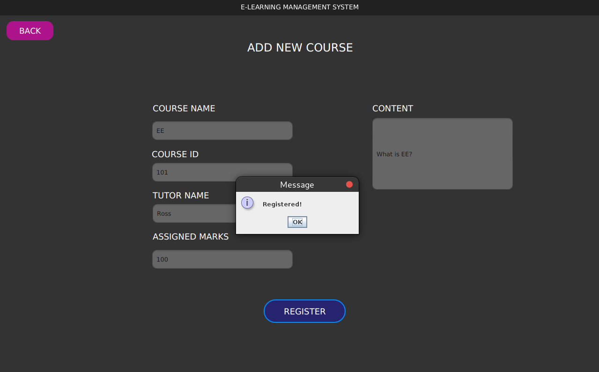
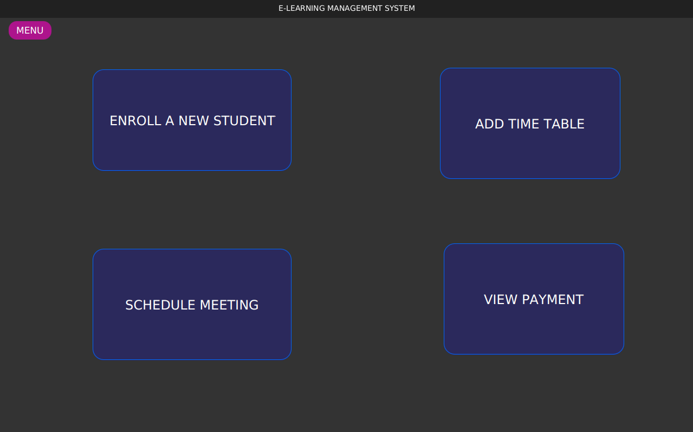
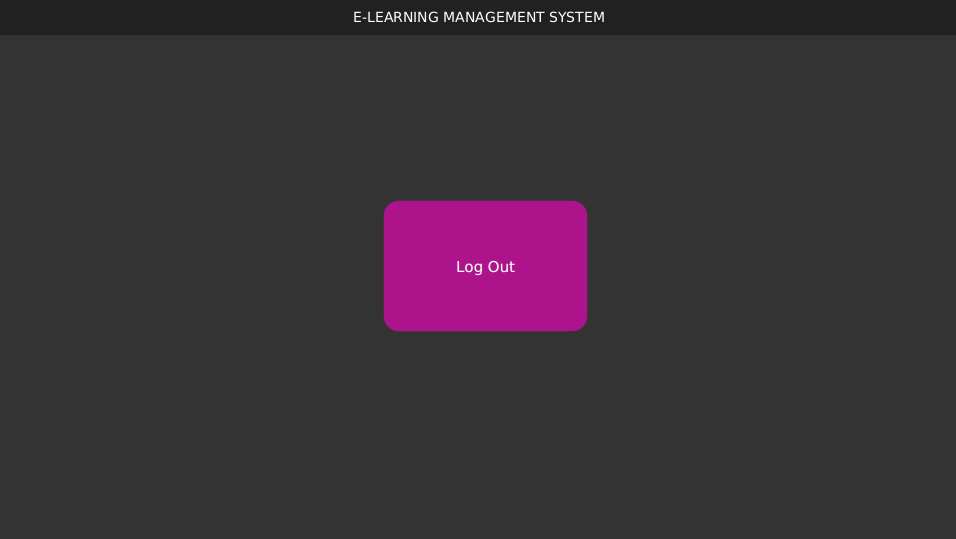

# Project Title

E-Learning Management System

## Short Description

A new learning management system has been created that enables college employees to administer their courses online; including the creation, updating, searching, and deletion of assessments and courses. The most important benefit of an E-Learning Management System is the easy accessibility to courses and engagement with learning resources. E-Learning Platform (ELP) is an efficient method of delivering courses since the resources are accessible from anywhere anytime, and the study materials could be accessed an endless number of times. The report provides information on the ELP via a use case model that depicts the process participants and the specific activities of each participant. The class diagram gives extensive information about the system's structure. It also provides a brief description of the cooperation taking place among the various system pieces. The sequence diagram has been used to represent functional requirements in which actors interact with objects. A suggested solution has been designed using OOP, and it employs GUI components to depict the flow of the ELP utilized by tutors, administrators, students, and parents. In the end, the report is assessed using the SDLC technique and discusses difficulties encountered throughout the creation of the ELP system.

## Table of Contents

- [Project Title](#project-title)
  - [Short Description](#short-description)
  - [Table of Contents](#table-of-contents)
  - [Key Features](#key-features)
    - [Use Case Diagram](#use-case-diagram)
    - [Class Diagram](#class-diagram)
    - [Sequence Diagram](#sequence-diagram)
  - [System Requirements](#system-requirements)
  - [Proposed Solution](#proposed-solution)
    - [Welcome Page](#welcome-page)
    - [Login Page](#login-page)
    - [Tutor Menu Controller](#tutor-menu-controller)
      - [Tutor: Add a New Course](#tutor-add-a-new-course)
      - [Tutor: Update a Course](#tutor-update-a-course)
      - [Tutor: Delete a Course](#tutor-delete-a-course)
      - [Tutor: Add an Assessment](#tutor-add-an-assessment)
      - [Tutor: Update an Assessment](#tutor-update-an-assessment)
      - [Tutor: Delete an Assessment](#tutor-delete-an-assessment)
    - [Student Menu Controller](#student-menu-controller)
      - [Student: Enroll In a Course](#student-enroll-in-a-course)
      - [Student: View Enrolled Course](#student-view-enrolled-course)
      - [Student: View Assessment](#student-view-assessment)
      - [Student: Answer Assessment](#student-answer-assessment)
      - [Student: Make Payment](#student-make-payment)
      - [Student: View Result](#student-view-result)
    - [Admin Menu Controller](#admin-menu-controller)
      - [Admin: Enroll a New Student](#admin-enroll-a-new-student)
      - [Admin: Add Timetable](#admin-add-timetable)
      - [Admin: Schedule Meeting](#admin-schedule-meeting)
      - [Admin: View Payment](#admin-view-payment)
    - [Parent Menu Controller](#parent-menu-controller)
      - [Parent: View Progress](#parent-view-progress)
      - [Parent: Communicate with Tutor](#parent-communicate-with-tutor)
    - [Log Out Page](#log-out-page)
  - [Software Development Life Cycle approach](#software-development-life-cycle-approach)
      - [How e-learning works in an agile SDLC](#how-e-learning-works-in-an-agile-sdlc)
  - [Professional, ethical and security issues](#professional-ethical-and-security-issues)
    - [Professional Issues](#professional-issues)
    - [Ethical Issues](#ethical-issues)
    - [Security Issues](#security-issues)
  - [End Product](#end-product)
  - [Technical Support](#technical-support)
  - [Contributing](#contributing)
  - [License](#license)

## Key Features

- **Course creation:** Instructors can create and manage courses, add quizzes and assignments.

- **Student management:** Admin can manage student registration, enrollment, parent meetings, manage the timetable, and track student payments.

- **Assessment management:** Instructors can design assessments, and grade assignments and quizzes.

- **Learning management:** Students can track their progress, access registered courses, receive feedback, view grades and pay tuition fees.

- **Communication:** Integrates with a messaging system for parent-teacher communication.

### Use Case Diagram

Actors are any entities that interact with the system. The actors might be human users, internal applications, or external apps. The tutor, admin, parents, and students are the actors in this use case model. In this approach, the tutor is an actor who plays two parts. They can contribute data by creating, editing, and removing courses. They can do the same functions in the assessment phase, such as adding, modifying, and removing assessments. The tutor will be able to examine the evaluation once the assignment has been submitted by the students. Admin's role is to schedule parent meetings, enroll new students, manage the timetable, and check student payments. Students are actors who may access their registered courses and view assessments. They are also able to pay for courses. When parents' meetings are held, the parent actor may see the students' development and communicate with the tutor.

    

    Tutor Use Case Diagram 

    

    Admin Use Case Diagram 

    

    Student Use Case Diagram 

    

    Parent Use Case Diagram 

### Class Diagram

The class diagram was used to depict the relationship between the Model and the Controller. The class diagram is widely recognized as the primary building element for object-oriented modeling. It is known as conceptual modeling because it has a structure in the application and a precise translation with computer code. The class diagram shows that four actors carry out various activities with the assistance of the accompanying "Model" and "Controller." The data logic is included in the "Model," while the data display technique is controlled by the "Controller." To log into the system, each of the four actors has been given a username and password. They can do the job described in the scenario by logging into the ELP.

    

    Class Diagram 

### Sequence Diagram

This sequence diagram depicted a communication between a tutor, an administrator, a student, a parent, and the learning management system. If the credential is incorrect, no one can log into the system. After verifying credentials, the authorization page takes the actor into the allocated functionalities for specific actors. The tutor teacher interacts with the interface to create, update, and delete a course and the same for assessment. The interface takes the request and passes it to the database. Afterward, the database shows the tutor the response to the request. Admin can enroll a new student, arrange meetings, manage timetables for courses and verify the payment by interacting with the interface. The requests go into the database and when the response comes, the interface shows it. Students can view the enrolled course and its details, pay the fees, and they can view the assessment of the tutor. Additionally, the student can answer the tutor’s questions. Parents can view students’ progress and communicate with tutors. 

    

    Sequence Diagram 

## System Requirements

- IDE: Netbeans/Eclipse
- Internet connection: High-speed internet connection is recommended
- OpenJDK 1.8.0_271
- OpenJFX-11.0.2_x64_bin-sdk

## Proposed Solution
The prototype of the ELP has been shown in this section. With the login page, the mentioned actors from the Usecase model can enter into the system. Tutor, admin, student, and parent are the actors.

### Welcome Page

The welcome page greets every user.

    

    Welcome Page 

### Login Page

Credentials for specific actors have been given below:

| **Actor** | **Username** | **Password** |
|:---------:|:------------:|:------------:|
|   Tutor   |    durham    |     tutor    |
|   Admin   |    durham    |     admin    |
|  Student  |    durham    |    student   |
|  Parents  |    durham    |    parent    |

The specified actors can log to the system by using above credentials.

    

    Login Page 

### Tutor Menu Controller
The page has been used to show the functionalities of the tutor. The tutor can choose any of them.

    

    Tutor Menu Controller 

#### Tutor: Add a New Course
With this function, the tutor can add a new course. The tutor has to fill up all fields in order to add a new course and click the “register” button.

    

    Add a New Course 

#### Tutor: Update a Course
With this function, the tutor is able to update a course. The tutor has to select a course from the table and update it in the text fields.

    

    Update a Course 

#### Tutor: Delete a Course
This functionality lets the tutor delete a course. The tutor will select the course from the table and once the “delete” button is clicked, the course will be deleted.

    

    Delete a Course 

#### Tutor: Add an Assessment
With this function, the tutor can add a new assessment. The tutor has to fill up all fields in order to add a new assessment and click the “Add” button.

    

    Add an Assessment 

#### Tutor: Update an Assessment
With this function, the tutor is able to update an assessment. The tutor has to select an assessment from the table and update it in the text fields.

    

    Update an Assessment 

#### Tutor: Delete an Assessment
This functionality lets the tutor delete an assessment. The tutor will select the assessment from the table and once the “delete” button is clicked, the assessment will be deleted.

    

    Delete an Assessment 

### Student Menu Controller
The page has been used to show the functionalities of the student. The student can choose any of them.

    

    Student Menu Controller 

#### Student: Enroll In a Course
This page shows the student in which course he/she is enrolled.

    

    Enroll In a Course 

#### Student: View Enrolled Course
With this page, the learner can enroll in a course by giving the student’s name and registration number.

    

    View Enrolled Course 

#### Student: View Assessment
Students can view the assessment given by the tutor from this page.

    

    View Assessment 

#### Student: Answer Assessment
Student can answer the question given by the tutor from this page.

    

    Answer Assessment 

#### Student: Make Payment
This page allows a student to pay the fee.

    

    Make Payment 

#### Student: View Result
Students can view their obtained marks in the specified course from this page.

    

    View Result 

### Admin Menu Controller
The page has been used to show the functionalities of the admin. The admin can use any of them.

    

    Admin Menu Controller 

#### Admin: Enroll a New Student
Admin can enroll a new student in an already available course created by the tutor.

    

    Enroll a New Student 

#### Admin: Add Timetable

Admin can specify the course duration and assignment duration in the selected course.

    

    Add Timetable 

#### Admin: Schedule Meeting

Admin is able to set up a meeting with the tutor and parent by using this page.

    

    Schedule Meeting 

#### Admin: View Payment

Admin can check which student has paid and who has not by accessing this page.

    

    View Payment 

### Parent Menu Controller

The page has been used to show the functionalities of the parent in this software. The parent can use any of them.

    

    Parent Menu Controller 

#### Parent: View Progress

Parent is able to check the students' progress with this functionality given on the software page.

    

    View Progress 

#### Parent: Communicate with Tutor
Parent is able to send a message to a tutor with this page.

    

    Communicate with Tutor 

### Log Out Page

The user will log out by clicking on the button given in this page.

    

    Log Out Page 

## Software Development Life Cycle approach

The Software Development Life Cycle technique was used to create the ELP as a high-quality system that satisfies goals, operates productively in given circumstances, is affordable to maintain, and is cost-effective to improve.  Here, Agile methodology has been used to develop the ELP system. Agile is the ability to continually adapt, the ability to constantly make improvements to the way of work. This strategy was chosen because it allows for speedy iteration and improvement of the system while also allowing for the display of outcomes in a visible manner. The agile methodology supports continuous involvement. If I develop the ELP in the steps where I have the stakeholders involved all the time then the ELP system is gonna evolve which is great because it's much easier for change management. Also, agile is more about empathy, it's more about understanding the stakeholders, it's more about paying attention to what the stakeholders say, and then building the ELP system. So in agile, there's a lot of focus on the persona I know who is using that application that I’m building and there's a lot of focus on the value that is created by using this application. Since agile is iterative, it's much easier to build new functionalities but tweaks the functionalities that are not working. So I can build and tweak, build and rebuild, and tweak which results in a perfect product in the end. The system is developed and organized to make the learning process as simple as possible. This method allows students to ask their tutors questions in real-time. It provides a great communication approach and access to course resources is easy. This system is developed and organized by keeping in mind that different persons will communicate with the system,  and it guarantees that information is sent to the desired persons. The ELP system is utilized to ease access for students to learn through online materials. The ELP system is maintained and upgraded on a regular basis. For all of the aforementioned causes, agile methodology is the finest methodology that enables the ELP system to give the greatest service to tutors, students, admins, and parents. The software was created using the Agile technique and the work of each stage of Agile.

#### How e-learning works in an agile SDLC

The Agile SDLC in the ELP system is discussed in the subsequent ways.

- Step 1: The aims and objectives of the ELP system are addressed to stakeholders, which include students, tutors, parents, and admins. All stakeholders are asked to collaborate and highlight any difficulties they are having with the planning process. This strategy is known as a scrum. The primary goal of this ELP is to create a system that allows tutors and students to engage with one another in order to get the necessary resources for the evaluation. Parents also have a role to view students’ progress and communicating with the tutor.

- Step 2: The tasks that have to be developed are now divided into parts or features, with all scrum members agreeing on what chunks must be completed. Each feature of the ELP system is created independently. It assists in the creation of tasks for each actor. Every participant has their own login page, which allows them to do the job described in the given scenario.

- Step 3: A sprint is a fixed amount of time in which certain work must be done and prepared for assessment. After constructing the approved functions, it was tested with stakeholders and the functionalities were assessed. By assessing it, any faults can be quickly fixed, and there will be numerous sprints for each course.

- Step 4: Once the stakeholders are completely pleased with all of the features, the project is transferred to the next development phase. This iteration is repeated until the entire project is completed.

## Professional, ethical and security issues
### Professional Issues

Professional ethics is mostly due to communication issues. There must be an interaction between the stakeholders and the developer. Proper training should be provided to everyone so that everyone can work effectively. Also, the developer should be given training in unit testing and documentation. Although unit testing and documentation do not feel that important when the coding is being done, it does become a huge issue after the project is done. Proper documentation is necessary to understand the coding from a technical or non-technical view and unit testing helps to reduce bugs. If the scrum masters and stakeholders are unfamiliar with the task, it is regarded as a professional concern because they are the main driving force behind the project. Developing e-learning systems for education is a problem for educators, since merely transferring courses online may be quite restrictive. These are the primary professional concerns that occurred while using agile methods to construct the project.

### Ethical Issues

The majority of ethical difficulties in online learning management systems stem from the unethical use of submitting available answers taken from the internet. It is much easier to cheat online rather than face to face. Students enrolled in a university or an online program can easily obtain fraudulent information and use it for their coursework. As a result, it is critical that the developer design and maintain the online learning management system with proper checks and balances to limit unethical behaviors. If the online learning management system’s developer pays attention to the design of such software, these ethical difficulties could have been overcome. Students must not allow to duplicate existing materials without the permission of the original owner and submitting those materials is a serious act of unethicality. Such behaviors could be reduced by integrating a fairly strong plagiarism checker. Agile strives to improve the mentioned work processes in the technical field. Agile is often used to define ethics in this field, as well as to assist organizations in making an effective decision for ethical awareness.

### Security Issues

There are some security issues in the proposed software. Although without the required credentials it is impossible to log in to the system, the credentials have not been encrypted. This leaves a malicious user to try to log in to the software. By manipulating credentials with password cracking, someone might gain access to the system and do something harmful. This could lead to accessing sensitive information. This could be prevented to a major degree by implementing RSA Algorithm. The database is hosted on a cloud platform, if an unauthorized person gains access to the database it would be a major security problem. If an authorized person logs in to the application and leaves it there unattended, an unauthorized person could enter into the system because the session expires after a period of inactivity has not been implemented. To avoid all of these problems, the agile security process could be implemented to develop the software. Agile Security is beneficial for rapid development since it aids in the construction of a secured E-Learning Management System. Developers and stakeholders could perform several security tests during the review process. 

## End Product

The learning management system was developed with the help of the Usecase diagram, class diagram, and sequence diagram which helps to write the code in an efficient manner. Besides, the diagram helps someone to understand what is going on under the software execution. The software employed OOP techniques to divide the whole software modules into smaller problems so that every solution to smaller problems leads to the completion of the whole software. To use a graphical user interface system, JavaFX was employed to design the graphical user interface. The chosen software development life cycle was Agile and the reason for it has been justified with the necessary grounds along with the evaluation. The professional, ethical, and security challenges that are associated with the software development process have been discussed. The E-Learning Management System has been critically analyzed and it has met most of the requirements.

## Technical Support

For technical support, please email me at [ornob011@gmail.com](mailto:ornob011@gmail.com). I will assist you promptly.

## Contributing

I welcome contributions to this project! If you have an idea for a feature or improvement, or if you have found a bug, please feel free to open an issue in the [issue tracker](https://github.com/ornob011/E-Learning-Platform/issues).

Before submitting a pull request, please make sure to:

- Read and follow our [contribution guidelines](CONTRIBUTING.md).
- Test your changes thoroughly.

Thank you for your contribution!

## License

    

This software is licensed under the GNU General Public License (GPL) version 3.

The full text of the GPL can be found in the `LICENSE` file, or online at <https://www.gnu.org/licenses/gpl-3.0.en.html>

